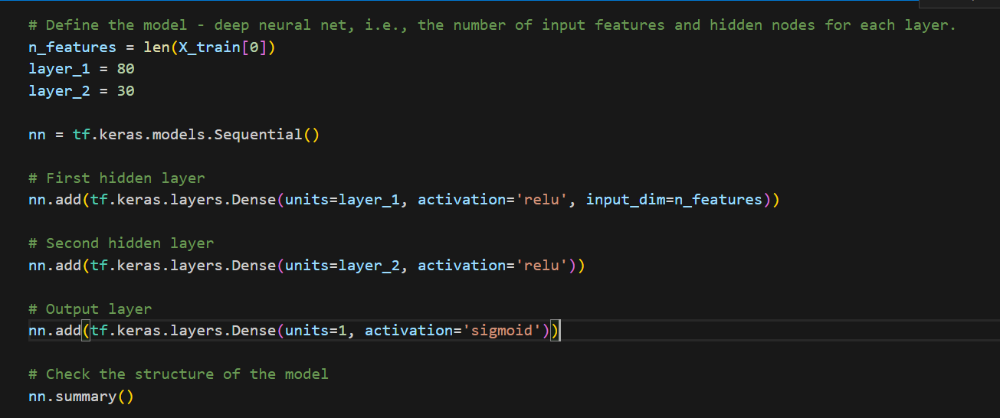
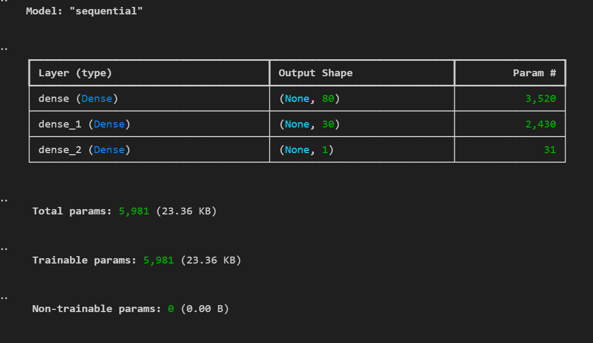
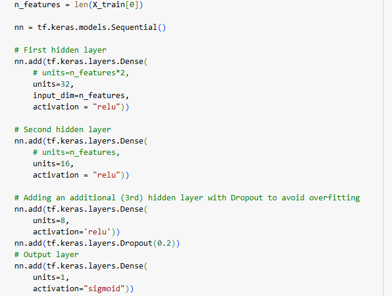
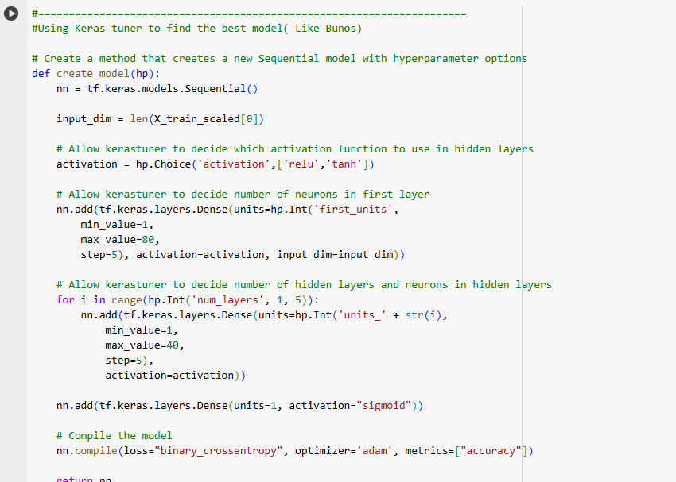
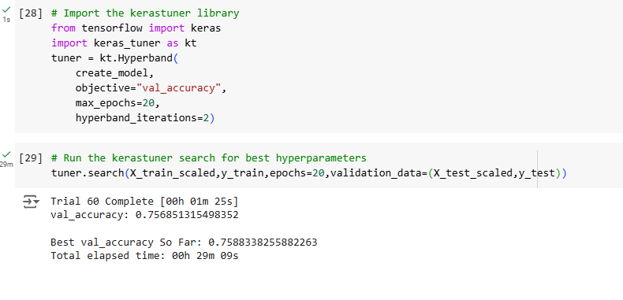
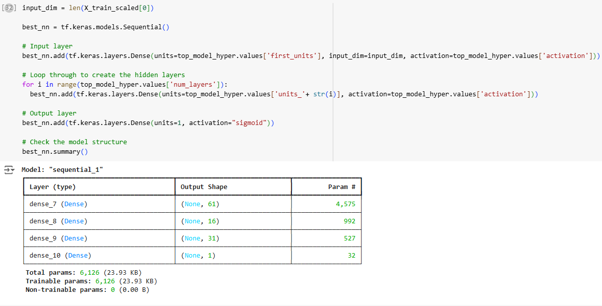

# Analysis Report

## Overview of the Analysis

### Purpose

- The purpose of this analysis is to support a nonprofit foundation called `Alphabet Soup` to help support them in selecting applicants with the best chances of being successful and using the funding effectively.

### Data Information and Model Goal

- The data was imported and read the charity_data.csv file.
- We drop the non-beneficial ID columns, 'EIN' and 'NAME'
- The initial dataset contained historical data on approx. 34,000 previous organizations that have receieved funding.
- For each organization the dataset contained information on (but not limited to):
  - Affiliated sector.
  - Government classification.
  - Usage for the funding.
  - Income amount.
  - Funding request.
  - If the organization used the funding effectively.
- Using this data, I was tasked with creating a neural network model that could predict an applicants chances of being successful.

## Results

### Data Preprocessing

- **What variable(s) are the target(s) for your model?**

  - The target variable in my model is the `IS_SUCCESSFUL` column from the dataset.
    - This defines if `1` - the organization used the funding effectively or `0` - the organization did not use the funding effectively
  - There's another potential target which I haven't focussed on with my models `STATUS`:
    - The `STATUS` column of the dataset signifies if the organization is active or not
    - If I was to complete this analysis again, I would look to use both the `IS_SUCCESSFUL` and `STATUS` as target variables
    - This could provide a more comprehensive model creation for the nonprofit foundation to not only determine if the funding will be used effectively but also if the organization would remain active too
- **What variable(s) are the features for your model?**

  - The features of the model contain the following columns:
    - `APPLICATION_TYPE` - Due to the number of unique values within this column, the values have been 'binned' into an `Other` category if the value is `< 500`.
    - `AFFILIATION`
    - `CLASSIFICATION` - Due to the numebr of unique values within this column, the values have been 'binned' into an `Other` category if the value is `< 1000`.
    - `USE_CASE`
    - `ORGANIZATION`
    - `STATUS`
    - `INCOME_AMT`
    - `SPECIAL_CONSIDERATIONS`
    - `ASK_AMT`
- **What variable(s) should be removed from the input data because they are neither targets nor features?**

  - There are two variables that were removed from the dataset due to being neither targets nor features. These columns are:
    - `EIN` - A unique reference number given to each organization requesting/receiving funding
    - `NAME` - The name of the organization making a request/receiving funding from the foundation
      ` `
      ` `

### Compiling, Training, and Evaluating the Model

- **How many neurons, layers, and activation functions did you select for your neural network model, and why?**

  - `AlphabetSoupCharity_Model_V1.H5`
    - For the initial model I chose to run three layers:
      - Input Layer - `80` Nodes - `Relu` Activation
        - I chose to run 80 nodes for this layer due to the number of dimensions within the dataset (42)
      - Hidden Layer - `30` Nodes - `Relu` Activation
        - 30 Nodes was selected for this layer, again due to the number of dimensions within the dataset
      - Output Layer - `1` Node - `Sigmoid` Activation
    - The initial model resulted in:
      - Accuracy: `73.03%`
      - Loss: `0.5617`
    - Model Summary:
      - 
      - 
  - Model Optimization:
    - In addition to abou model I attempted to optimize the model made use of the `keras_tuner` library
    - This provides the ability to test a number of different options for the model, including:
      - The number of different hidden layers within the model
      - How many neurons per layer
      - Varying activation functions
      - after testing model with differect parametrs, I set an optimized model as below:
      - 
      - the result was good, Loss:  0.5022, Accuracy:  0.7518
    - atempt fo finding best model using e of the `keras_tuner` model:
      - 
    - the result was:
      - 
      - Afeter excuting the tuner method this model was set as bets model:
      - 
      - the result was good as well:268/268 - 1s - 4ms/step - accuracy: 0.7527 - loss: 0.5077
        Loss:  0.5077, Accuracy:  0.7527
- **Were you able to achieve the target model performance?**

  - Fortunatley I  achieved the target model performance by:
  - setting my asumption: Loss:  0.5022, Accuracy:  0.7518
  - Tuner best model: Loss:  0.5077, Accuracy:  0.7527
  - the models are atteched in files:

    - AlphabetSoupCharity_Optimized.h5
    - AlphabetSoupCharity_Optimized_Bonus.h5
- **What steps did you take in your attempts to increase model performance?**

  - As you can see from the `Model Optimization` section above, I used to set a model myself, by changing effective parameters and also the Keras_tuner library to create three different tuner programs.
  - My model was achived the target.
  - The primary attempts to improve model performance was to increase the number of hidden layers within the model
    - My optimization results showed that the best model had `2` hidden layers
  - Or to increase the number of neurons per hidden layer
    - My optimization results showed between  `1-26` neuron's were required per layer
  - I looked into the dataset to see if there were any variables that could be removed to improve the model performance.
    - In my opinion, all of the data after the initial preprocessing steps was relevant for the model.
    - I think this would be an ideal situation to discuss the dataset further, with key stakeholders for the foundation, to better understand variable priority from the data.

## Summary

- **Summary of Results**

  - Overall the deep learning model did give near 73% accuracy on a dataset with many dimensions and with some complexity.
  - By using the Keras tuner library the result was goog and model was achived the target of %75 as well.
- **Alternative Model**

  - An alternative model to the one used within my analysis is the `Random Forest` algorithm
  - This model is widely used within the finance industry
  - The model can be easily scaled to large datasets, is typically good at not overfitting to data, and is resillient to noisy data
  - The random forest model works by creating random predictions from decision trees and creates an average of these results to build a model
